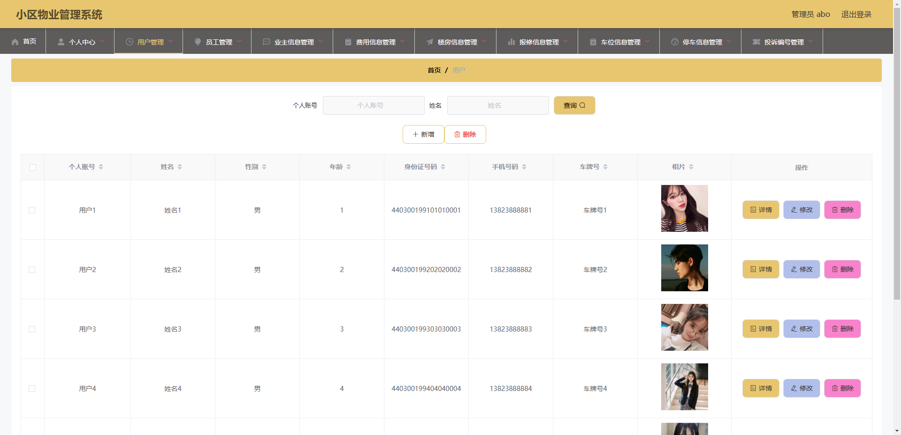
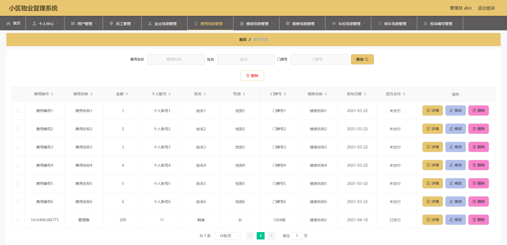

# 1 项目介绍
基于SSM+Vue的小区物业管理系统：后端 SpringBoot、Mybatis-Plus，前端Vue+ElementUI，具体功能如下：
## 管理端
- 用户管理
- 员工管理
- 业主信息管理
- 费用管理
- 楼房管理
- 报修管理
- 车位管理
- 停车信息管理
- 投诉信息管理
- 公告管理
- 个人中心：查看和修改个人信息
## 用户端
- 业主信息管理
- 费用管理
- 楼房管理
- 报修管理
- 车位管理
- 停车信息管理
- 投诉信息管理
- 查看公告
- 个人中心：查看和修改个人信息
## 员工端
- 楼房管理
- 报修管理
- 投诉管理
- 公告管理
- 部门管理
- 个人中心：查看和修改个人信息
# 2 系统运行截图
## 2.1 用户登录

## 2.2 用户管理

## 2.3 员工管理

## 2.4 业主信息管理

## 2.5 费用信息管理

## 2.6 楼房信息管理

## 2.7 报修信息管理

## 2.8 车位信息管理

## 2.9 停车信息管理

## 2.10 投诉信息管理

## 2.11 万字文档

## 2.12 ppt

# 3 数据库设计

# 4 源码数据库获取(收费)

